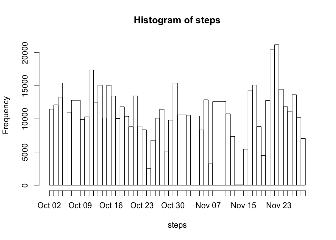
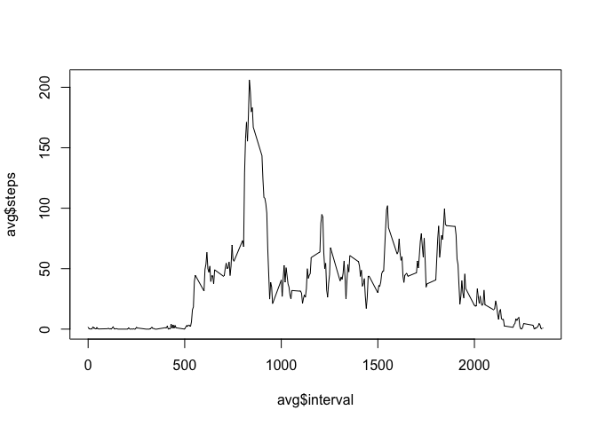
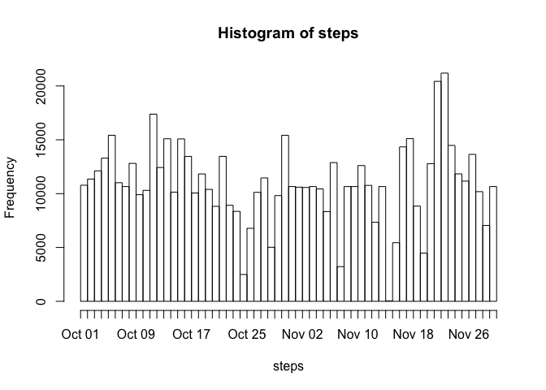
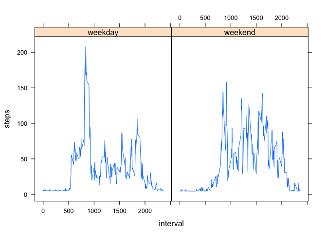

# Reproducible Research: Peer Assessment 1


## Loading and preprocessing the data


```r
setwd('~/Downloads/peer1/RepData_PeerAssessment1')
df=read.csv('activity.csv')

# Convert date to...date : always like to have it from the beginning
df$date <- as.Date(df$date)

head(df)
```

```
##   steps       date interval
## 1    NA 2012-10-01        0
## 2    NA 2012-10-01        5
## 3    NA 2012-10-01       10
## 4    NA 2012-10-01       15
## 5    NA 2012-10-01       20
## 6    NA 2012-10-01       25
```


## What is mean total number of steps taken per day?

Calculate the total number of steps taken per day:


```r
aggregate(steps ~ date, df, sum)
```

```
##          date steps
## 1  2012-10-02   126
## 2  2012-10-03 11352
## 3  2012-10-04 12116
## 4  2012-10-05 13294
## 5  2012-10-06 15420
## 6  2012-10-07 11015
## 7  2012-10-09 12811
## 8  2012-10-10  9900
## 9  2012-10-11 10304
## 10 2012-10-12 17382
## 11 2012-10-13 12426
## 12 2012-10-14 15098
## 13 2012-10-15 10139
## 14 2012-10-16 15084
## 15 2012-10-17 13452
## 16 2012-10-18 10056
## 17 2012-10-19 11829
## 18 2012-10-20 10395
## 19 2012-10-21  8821
## 20 2012-10-22 13460
## 21 2012-10-23  8918
## 22 2012-10-24  8355
## 23 2012-10-25  2492
## 24 2012-10-26  6778
## 25 2012-10-27 10119
## 26 2012-10-28 11458
## 27 2012-10-29  5018
## 28 2012-10-30  9819
## 29 2012-10-31 15414
## 30 2012-11-02 10600
## 31 2012-11-03 10571
## 32 2012-11-05 10439
## 33 2012-11-06  8334
## 34 2012-11-07 12883
## 35 2012-11-08  3219
## 36 2012-11-11 12608
## 37 2012-11-12 10765
## 38 2012-11-13  7336
## 39 2012-11-15    41
## 40 2012-11-16  5441
## 41 2012-11-17 14339
## 42 2012-11-18 15110
## 43 2012-11-19  8841
## 44 2012-11-20  4472
## 45 2012-11-21 12787
## 46 2012-11-22 20427
## 47 2012-11-23 21194
## 48 2012-11-24 14478
## 49 2012-11-25 11834
## 50 2012-11-26 11162
## 51 2012-11-27 13646
## 52 2012-11-28 10183
## 53 2012-11-29  7047
```

If you do not understand the difference between a histogram and a barplot, research the difference between them. Make a histogram of the total number of steps taken each day.

I'm not 100% sure I understand the question here, because it seems to imply, that they want us to set the data in a format so that we can use hist(), even if a barplot would be more indicated as we already have counts per interval and we could use aggregate to more naturally use a barplot. 
So although it doesn't seem the most adequate way to do it, I transform the data to use hist().


```r
# Make a copy of df, with only the rows which do not have NA
df1 <- df[complete.cases(df),]

# Create a var with the date of each step
steps <- rep(df1$date,df1$steps)

# Now do the hist
hist(steps,breaks=unique(steps),freq=T)
```

 

Calculate and report the mean and median of the total number of steps taken per day


```r
daily <- aggregate(steps ~ date, df, sum)
head(daily)
```

```
##         date steps
## 1 2012-10-02   126
## 2 2012-10-03 11352
## 3 2012-10-04 12116
## 4 2012-10-05 13294
## 5 2012-10-06 15420
## 6 2012-10-07 11015
```

```r
summary(daily)
```

```
##       date                steps      
##  Min.   :2012-10-02   Min.   :   41  
##  1st Qu.:2012-10-16   1st Qu.: 8841  
##  Median :2012-10-29   Median :10765  
##  Mean   :2012-10-30   Mean   :10766  
##  3rd Qu.:2012-11-16   3rd Qu.:13294  
##  Max.   :2012-11-29   Max.   :21194
```

As above there is a mean of 10766 and a median of 10765 steps per day

## What is the average daily activity pattern?


Make a time series plot (i.e. type = "l") of the 5-minute interval (x-axis) and the average number of steps taken, averaged across all days (y-axis)


```r
avg <- aggregate(steps ~ interval, df1, mean)
plot(avg$interval,avg$steps,type='l')
```

 

Which 5-minute interval, on average across all the days in the dataset, contains the maximum number of steps?


```r
avg[which.max(avg$steps),]
```

```
##     interval    steps
## 104      835 206.1698
```

## Imputing missing values

Calculate and report the total number of missing values in the dataset (i.e. the total number of rows with NAs)


```r
nrow(df[is.na(df$steps),])
```

```
## [1] 2304
```

Devise a strategy for filling in all of the missing values in the dataset. The strategy does not need to be sophisticated. For example, you could use the mean/median for that day, or the mean for that 5-minute interval, etc.
Create a new dataset that is equal to the original dataset but with the missing data filled in.

Will work with a df2 copy now, and replace NAs with the mean of that day

```r
df2 <- transform(df, steps = ifelse(is.na(steps),mean(df[df$date==date,]$steps,na.rm=TRUE), steps))
```

Make a histogram of the total number of steps taken each day and Calculate and report the mean and median total number of steps taken per day. Do these values differ from the estimates from the first part of the assignment? What is the impact of imputing missing data on the estimates of the total daily number of steps?


```r
steps <- rep(as.Date(df2$date),df2$steps)
hist(steps,breaks=unique(steps),freq=T)
```

 

As for the mean and median


```r
daily <- aggregate(steps ~ date, df2, sum)
head(daily)
```

```
##         date    steps
## 1 2012-10-01 10766.19
## 2 2012-10-02   126.00
## 3 2012-10-03 11352.00
## 4 2012-10-04 12116.00
## 5 2012-10-05 13294.00
## 6 2012-10-06 15420.00
```

```r
summary(daily)
```

```
##       date                steps      
##  Min.   :2012-10-01   Min.   :   41  
##  1st Qu.:2012-10-16   1st Qu.: 9819  
##  Median :2012-10-31   Median :10766  
##  Mean   :2012-10-31   Mean   :10766  
##  3rd Qu.:2012-11-15   3rd Qu.:12811  
##  Max.   :2012-11-30   Max.   :21194
```

In my case this doesn't change much, because I'm replacing the ones I didn't use before by the means of the remaining, so the mean remains the same.

## Are there differences in activity patterns between weekdays and weekends?

Create a new factor variable in the dataset with two levels – “weekday” and “weekend” indicating whether a given date is a weekday or weekend day.


```r
df2$weekend <- factor(ifelse(weekdays(as.Date(df2$date)) %in% c("Sunday","Saturday"),"weekend","weekday"))
```

Make a panel plot containing a time series plot (i.e. type = "l") of the 5-minute interval (x-axis) and the average number of steps taken, averaged across all weekday days or weekend days (y-axis). See the README file in the GitHub repository to see an example of what this plot should look like using simulated data.

Only now how to do it with lattice:

```r
avg <- aggregate(steps ~ interval+weekend, df2, mean)

# Plot chart
library(lattice) 
xyplot(steps~interval|weekend,dat=avg,type='l')
```

 

